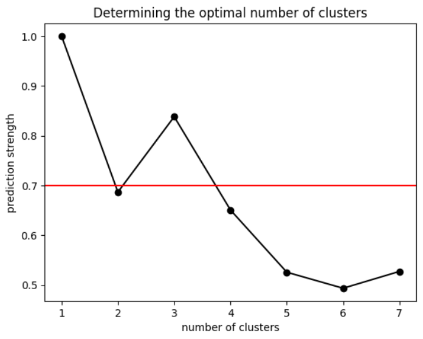
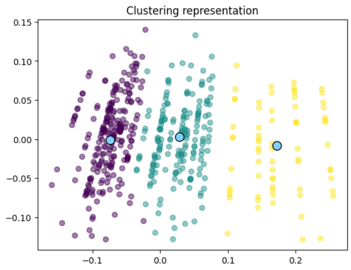

---
> # Learner and predictor for a clustering task - Unsupervised M.L
>
> 💻 Authors: Wilber B. Quito, Andrea Ramirez
>
> 🗓️ Date: 11/12/2022
>
> ✍🏼 Machine Learning - Master in Data Science - *Universitat de Girona*
___

# Clustering learner with K-means

The aim of this project is to group samples linked by an optimal number of clusters using a clustering algorithm.

We decided to use the K-means as clustering algorith because one of its adventages is of scaling to large data sets, and it can easily adapt to new examples. Since one disadventage of using this algorithm is that we must know *k*. There are some options to find the optimal number of clusters with K-means, for example GAP. However, to evaluate the number of clusters we've used the Prediction Strength algorithm to find the *optimal number of centroids*, hence the **optimal number of clusters (k)**. 


## Implementation

The implementation is made in two different scripts. We have the scripts *learner.py* and *preditor.R*.

### learner.py

Since we decided to use the K-means algorithm, we import it from the *sklearn.cluster* library, along with other libraries to transform and explore the data.

The script expects to find a file named *training.csv* which should have the samples to clusterize. 

```
training_csv = './training.csv'
```

Before finding the optimal number of clusters, our script reads the data set as a *data frame*, and then it drops all the rows that contain N/A. 

Taking into consideration that our training data comes from the voters turnout, we decided to transform the total population into all the people that didn't vote, and then to normalize the data to standardize it, and reduce data redundancy and improve protect the model's integrity. 

```
y = X.iloc[:, len(X.columns) - 1]
X = X.drop(X.columns[-1], axis=1)
voters = X.iloc[:,0:len(X.columns)].sum(axis=1)
X = X.div(y, axis=0)
X.insert(loc=len(X.columns), column=int(len(X.columns)), value=(y-voters) / y)
X.head()
```

The implementation tries to find the optimal number of clusters between 1 and 7 included. 

```
K = 7
clusters = range(1, K + 1)
wss_list = []

for k in clusters:
    model = KMeans(n_clusters=k, random_state=73)
    model.fit(X)
    wss_list.append(model.inertia_)
```

To have a first look of the clusters in our data set, we perform an Elbow plot:

```
# plotting
_, ax = plt.subplots()
ax.plot(clusters, wss_list, '-o', color='black')
ax.set(title='Elbow plot', 
       xlabel='number of clusters', 
       ylabel='WSS');
 ```
 


From the Elbow plot we suspect that the ideal number of clusters for the training sample is 2.
 
We had not used any library to compute the Prediction Strength, instead, we implemented from scratch the algorithm using the following equation. The implementation is in the file *compute.py* in the *learner* module. We wanted to use the recomended threshold between 0.8 and 0.9, however with the training data that we were using it could only determine 1 optimal cluster, therefore, we lowered the threshold to 0.75.


```
results = ps.prediction_strength_of_clusters(X, K)
threshold = 0.75
ry = list(map(lambda x : x[1], results))
_, ax = plt.subplots()
ax.plot(clusters, ry, '-o', color='black')
ax.axhline(y=threshold, c='red');
ax.set(title='Determining the optimal number of clusters', 
       xlabel='number of clusters', 
       ylabel='prediction strength');
```



Once the algorithm has found the optimal number, it exports the number of centroids found in the *training.csv* distribution and it's centroids into a file named *param.out*. The exported centroids are normalized in the scale 0 to 1. 

```
k_optimal = -math.inf
s_optimal = -math.inf
centroids = []

for k, s, c in results:
    if s > threshold:
        k_optimal, s_optimal, centroids = k, s, c

le.export(k_optimal, centroids, './param.out')
```

*param.out*

```
2
0.47,0.02,0.03,0.02,0.03,0.07,0.36
0.27,0.06,0.04,0.04,0.08,0.05,0.47
```

Still, to verify that our model works, we plot the clusters.

```
if centroids is None:
    print("No centroids defined")

PCA_model = PCA(n_components=2).fit(X.to_numpy())

labels = KMeans(n_clusters=k_optimal, random_state=73).fit(X.to_numpy()).labels_

# Function to plot current state of the algorithm.
# For visualisation purposes, only the first two PC are shown.
PC = PCA_model.transform(X.to_numpy())
C2 = PCA_model.transform(centroids)

ax = plt.scatter(PC[:,0], PC[:,1], c=labels, alpha=0.5)
ax = plt.scatter(C2[:,0], C2[:,1], c='#82cfff', s=100, edgecolors = 'black')
ax = plt.title("title")
ax = plt.show()
ax = plt.clf()
```



### predictor.R

The script get's the output of *learner.py*, picks the normalized centroids and reads the file *testing.csv* which applies normalization and assign each sample of the testing into a cluster by computing the minimun Euclidean distance between each sample and the centroids. Finally, exports the clusterization into a file named *clustering.out* where each *i* row of this file is the clustering assignation of the *i* sample of *testing.csv*.

*testing.out*

```
28782,17022,26642,13335,19827,7621,217210
271,14,25,10,18,45,594
57,11,5,3,9,18,170
8319,4203,4203,3378,8747,1670,63255
1685,1275,619,938,1771,453,12125
7615,11564,4644,7914,11156,2712,86234
```

*clustering.out*

```
2
1
2
2
2
2
```


